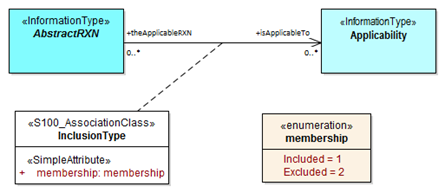

# Limitation by Vessels Characteristics and Cargo
(Source - S-131 Edition 1.0.0 DCEG)

## Capturing the application of a regulation, recommendation, etc. to specified kinds of vessels

This will generally be modeled by an `InclusionType` relationship between the abstract supertype `AbstractRxN` (as the superclass for Regulations, Restrictions, Recommendations, and NauticalInformation information type classes) and the `Applicability` class.

Encoders may find it easiest to capture the application of a regulation (recommendation, etc.) to a class or set of vessels in three phases:

1. Encode the operative part of the regulation (the part that describes what the vessels subject to the regulation must or must not do), creating an instance of `Regulations` (or `Recommendations`, etc., as appropriate). Descriptions of what kinds of vessels are subject to the regulation must be excluded from the content of the `Regulation` instance.
2. Create an `Applicability` information type and encode the description of what kinds of vessels are subject to (or exempted from) the regulation.
3. Link the two using an `InclusionType` with `membership=included` if the vessels described by `Applicability` are subject to the regulation, or `membership=excluded` if they are explicitly exempted from the regulation.

It is not necessary to create separate instances of the regulation for inclusion and exclusion.

## Capturing the permissibility or otherwise of a geographic feature for specified kinds of vessels

Encoders may find it easiest to capture the permissibility of a feature to specified kinds of vessels in three phases:

1. Create the geographic feature if it does not already exist.
2. Create an `Applicability` information type and encode the description of what kinds of vessels are required to use the geographic feature.
3. Link the two using a `PermissionType` with `categoryOfRelationship = required`.

For other relationships (prohibited, not recommended, etc.), steps 2 and 3 should be modified accordingly.

## Constructing the Applicability information type

Where the source material describes complex conditions, encoders may find it useful to write out the conditions in structured language with grouping parentheses, e.g., “(condition A) AND (condition B) AND (condition C)”, or draw diagrams, before encoding `Applicability` and its associations.

Note: The model limitation on mixing logical connectives means some nested conditions cannot be encoded in a single `Applicability` instance.

**Example**: The condition “(condition A) AND ((condition B) OR (condition C))” must be encoded as two `Applicability` instances:
- Applicability 1: (condition A) AND (condition B)
- Applicability 2: (condition A) AND (condition C)

| Complex Condition | Encode As |
|-------------------|-----------|
| (condition A) AND ((condition B) OR (condition C)) | Applicability 1: (condition A) AND (condition B) Applicability 2: (condition A) AND (condition C) |

Data producers may contact NIPWG with questions about encoding complex conditions.

As a last resort, conditions may be written in natural language and encoded in the information attribute. It is acceptable for an `Applicability` to have only the information attribute populated.

# Textual Regulations and Notes
(Source - S-131 Edition 1.0.0 DCEG)

## Use of appropriate information type

The appropriate information type from `Regulations`, `Restrictions`, `Recommendations`, and `NauticalInformation` should be used depending on the nature of the information:

1. `Regulations` – for official rules or laws mandated by authorities.
2. `Restrictions` – for temporary or long-term restrictions that may lack legal force.
3. `Recommendations` – for suggestions or procedures that are not mandatory.
4. `NauticalInformation` – for general informative material that doesn’t fall under the above.

## Content

Text should be encoded in the `textContent` attribute. It should be concise, include pertinent information, and avoid overly legalistic full texts. Use summaries and references where necessary. Supplement with graphics using the `graphic` attribute.

## Classification

Use the `categoryOfRxN` and `actionOrActivity` attributes within `rxnCode` where possible. These allow for custom entries like `other: underRepair`. Non-standard entries are display-only and not processed for filtering or symbolization.

## Titles and headlines

- Use `rxnCode/headline` for brief topic headings.
- `textContent/information/headline` may be used for sub-heads but must not duplicate `rxnCode/headline`.
- Headline order should reflect source hierarchy or go from general to specific.

# Schedules

Use `ServiceHours` for operating times and associate to `Authority`. Use `NonstandardWorkingDay` for holidays.

| **Normal operations** ||||
|------------------------|------------------|--------------------|----------------------------|
| Operations             | Days             | Time               | Notes                      |
| Normal                | Mon              | 11:00 to 15:00     | Banker's hours every Monday|
| Normal                | Tue - Thu        | 05:00 to 17:00     | when `dayOfWeekIsRange=true` |
| Normal                | Fri, Sun         | 06:00 to 10:00     | when `dayOfWeekIsRange=false` |

| **Exceptions** ||||
|----------------|------------------------|--------------------|------------------------------|
|                | holidays or special days |                    | operation details            |

For complex schedules, use a table. For simple ones, phrases are acceptable.

Example:

**ServiceHours**
- `categoryOfSchedule = 1` (normal)
- `dayOfWeek = 2, 4` (Mon, Wed) – no range
- `dayOfWeek = 5, 7` (Thu–Sat) – with time range

**NonStandardWorkingDay**
- Fixed: `--12-26`
- Variable: “Last Monday in May”
- `information.text = "By pre-arrangement"`

Interpretation: Service operates 24h on Mon/Wed, 08:00–16:00 on Thu–Sat, by arrangement on specific holidays.

# Contact Information

Use `ContactDetails` for agencies, services, etc.

| Type Associated          | Purpose                        | Association Name | Notes |
|--------------------------|--------------------------------|------------------|-------|
| Authority                | General contact info           | AuthorityContact | Use for agency-level data |
| Geographic Feature       | Specific service location info | ServiceContact   | Encoded in feature type   |

# Meta Features

## Data Coverage

- Must cover all geographic features.
- No overlaps in same dataset.
- Can use multiple with different `maximumDisplayScale`.
- Attributes:
  - `maximumDisplayScale`
  - `minimumDisplayScale`

Avoid excessive fragmentation. Only one is typical.

## Quality of Non-Bathymetric Data

Used for horizontal/vertical uncertainty. Should align spatially with `DataCoverage`.

## Sounding Datum and Vertical Datum

Only one of each per dataset. All depth/elevation values must use the same datum.

# Feature Names

Use `featureName` for all named features.

- Populate language attribute unless universal.
- Don’t duplicate names in same language for a single feature.

# Text Placement

Avoid using `TextPlacement` in Edition 1.0.0 datasets due to evolving specifications.

