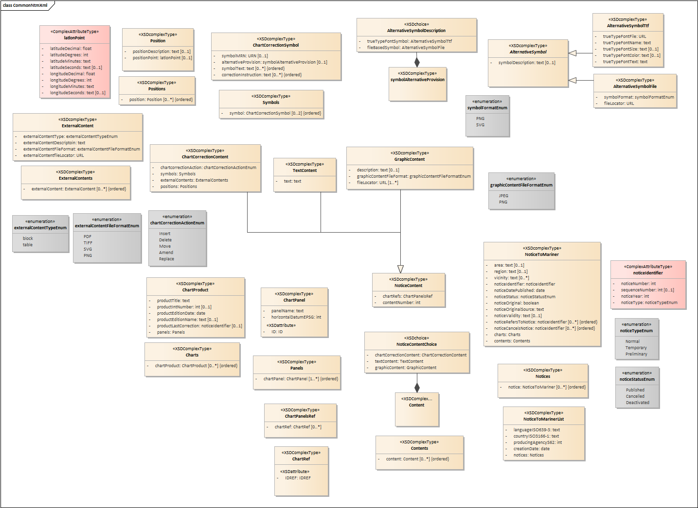

(This data is transferred from NIPWG WIKI. Links in the text are not working, but the files are found within this folder)

# XML Chart Correction Examples for Comparison

---

## Finnish XML

**Description by TRAFICOM:**

NtM chart corrections in XML are produced since 2016. A custom XSD-schema is used. XML for booklets is imported into InDesign software and made into PDF booklets using a "semi-automatic" workflow. The XML schema defines a "list of notices", and the same XML format is used for the T&P list. Separate XSL translations are used to produce different products. Example includes Native XML format, common XML format and common XML translated into HTML.

- **Examples:** [FI ntm issue 2019 30.zip](File:FI%20ntm%20issue%202019%2030.zip)

**Contacts:** stefan.engstrom@traficom.fi

---

## French XML

**Description by Shom:**

NtM chart corrections in XML are produced since 2018, with CARIS “Publication module” customized for Shom...

- **Examples:** [Xml_fr.zip](File:Xml_fr.zip)

**Contacts:** pierre-yves.le.moigne@shom.fr, jonathan.mouton@shom.fr

---

## German XML

**Description by BSH**

- **Examples:** [DE_xml.zip](File:DE_xml.zip)

**Contacts:** daniel.zuehr@bsh.de

---

## Italian NtM

**Description by Italian HO**

- **Examples:** [Italian_NtM.zip](File:Italian_NtM.zip)

**Contacts:** ludovico_sturla@marina.difesa.it

---

# Conventions

## Multiple use of XML

The data model should allow references from one correction to multiple charts...

## Data model files

- **GitHub Repo:** [ntm_common_xml](https://github.com/fihofi/ntm_common_xml)
- **Releases:** [Download Latest](https://github.com/FihoFi/ntm_common_xml/releases/)

### UML diagram

**Diagram:** 

### NoticeContent Types

- **TextContent**: Simple unformatted text
- **ImageContent**: Chart images
- **ChartCorrectionContent**: Structured correction content

### Example Table: ChartCorrectionContent

| Action   | ObjectA |       | ObjectB | Row Note |
|----------|---------|-------|---------|----------|
| textA    |         | textB | row_note |
| textA    |         | textB | row_note |
| textA    |         | textB | row_note |

Positions:
```
lat lon description
lat lon description
lat lon description
```

---

## Images and Symbols

- Textual description (mandatory)
- Graphical symbols (optional): SVG, TIFF, TTF

Example:
```
<symbolTxt>
<BOYCAR>
  <BOYSHP>pillar</BOYSHP>
  <CATCAM>north cardinal mark</CATCAM>
  <COLOUR>black, yellow</COLOUR>
</BOYCAR>
<TOPMAR>...</TOPMAR>
<LIGHTS>...</LIGHTS>
<ChartLabel>
  <Content>Fl.Y.3s</Content>
</ChartLabel>
</symbolTxt>
```

### Associated XSD
```xml
<xs:schema xmlns:xs="http://www.w3.org/2001/XMLSchema">
  <xs:element name="symbolLeft">
    <xs:element name="symbolVector" minOccurs="0"/>
    <xs:element name="symbolRaster" minOccurs="0"/>
    <xs:element name="symbolFont" minOccurs="0"/>
    <xs:element name="symbolTxt" minOccurs="1"/>
  </xs:element>
</xs:schema>
```

---

## Status of Correction

- **Published** – in force
- **Cancelled** – replaced or superseded
- **Deactivated** – no longer valid due to internal reasons

---

## Chart Corrections vs General Notifications

### Table: S4 References

| S4 Ref | Standard/Permanent Notice | T&P Notice | Notes |
|--------|---------------------------|------------|-------|
| B-630.4 j) | YES | NO | |
| B-631.3 Title | YES | YES | |
| B-631.4 Text | YES | NO | ES, FR, GB, HR, TN use text description |
| B-631.5 Positions | YES | YES | |
| B-631.6 Authority | YES | YES | |
| B-631.7 Charts affected | YES | YES | |
| B-631.8 Amplifying notes | YES | NO | Often used |
| Cancellation of notice | NO | YES | |

---

## Language

Support for multilingual content via `MultilangString`.

---

## Block Correction

- Supplied as georeferenced PDF
- Optional center coordinate
- Link in the notice

---

## XML Examples after the Workshop

### Finland

- **Examples:** [FI ntm issue 2019 30.zip](File:FI%20ntm%20issue%202019%2030.zip)

### France

- [FR_NTM_XML.zip](File:FR_NTM_XML.zip)

### Germany

### Italy

- [Italy.XML](File:Italy.XML)

### Norway

- [NO_NTM_XML.zip](File:NO_NTM_XML.zip)

### UK

### US
